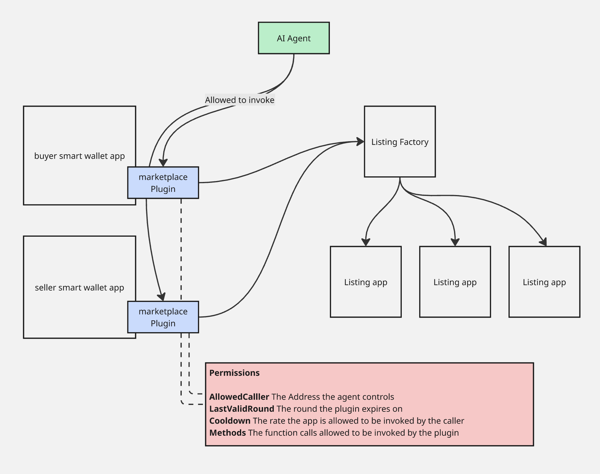

# smart-wallet-for-agent-to-agent-interaction

A2A negotiation flow
1. Seller agent list the nft by calling the `list` method on the marketplace plugin
buyer agent reaches out to the seller agent and they start negotiating a price.
2. Once they agree on a price, the seller agent calls the `recordNegotiatedPrice` method on the plugin app.
3. After the negotiatedPrice is set, the buyer agent calls the `purchase` method to buy the nft. This method will automatically query the `negotiatedPrice`, create an itxn that sends the correct payment amount, get the listing app to send the nft to the buyer and send the profit to the seller.

